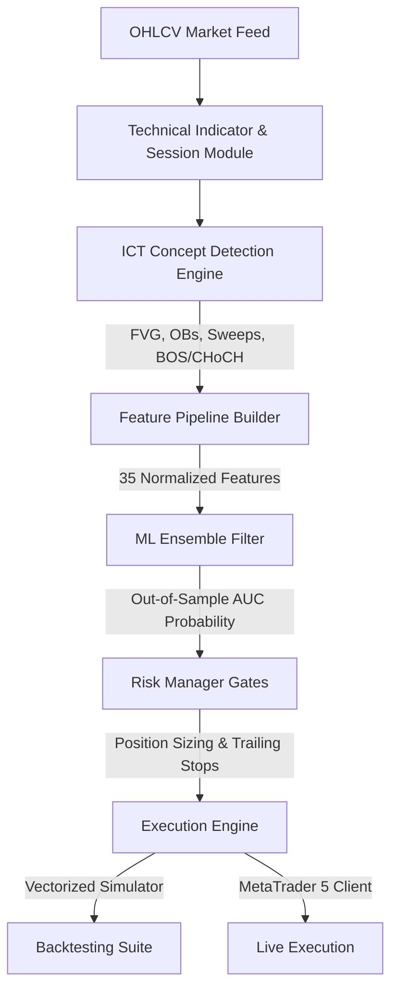

# Inner Circle Trader (ICT) Quantitative Trading Bot & ML Ensemble Suite

A production-ready quantitative trading framework in Python that automates the **Inner Circle Trader (ICT)** methodology. It couples high-precision market structure detection with a stacked Machine Learning Ensemble (LightGBM + XGBoost) and a modern, high-fidelity web dashboard featuring real-time Server-Sent Events (SSE) telemetry.

> [!WARNING]
> **Educational and Research purposes only.** Algorithmic trading carries substantial financial risk. MetaTrader 5 live integration should be rigorously validated on demo accounts before deploying live capital.

---

## 🏛️ Core Pillars of the Framework



### 1. High-Precision ICT Concept Detection
The core detection layer (`src/detection/`) translates qualitative trading rules into exact mathematical formulas:
* **Fair Value Gaps (FVG):** Locates three-bar inefficiencies (`high[i-2] < low[i]` or `low[i-2] > high[i]`) scaled against the Average True Range (ATR) to filter out noise.
* **Order Blocks (OB):** Identifies institutional accumulation/distribution points by tracking the last counter-trend candle prior to a strong directional expansion.
* **Liquidity Sweeps:** Flags swing highs and lows that pierce recent local maximums/minimums to capture institutional liquidity raids.
* **Break of Structure (BOS) & Change of Character (CHoCH):** Tracks short and long-term trend shifts based on candles confirming breaks of structural swing points.
* **Trading Sessions:** Classifies market activity into Asian, London, and New York windows, computing session volatility indices to weigh setups dynamically.

### 2. Machine Learning Ensemble Pipeline
To reduce false positives, the system passes all generated setups through a stacked ML pipeline:
* **Feature Engineering:** Builds a **35-dimension feature vector** including session state, relative FVG gaps, Order Block distances, time-of-day, and relative swing-point volumes.
* **Multicollinearity Filter:** Automatically prunes highly correlated indicators (threshold adjustable, defaults to `0.7`).
* **Ensemble Models:** Combines **LightGBM** and **XGBoost** classifiers.
* **Walk-Forward Validation:** Validates model robustness using an out-of-sample temporal split to ensure predictive capacity holds across changing market regimes.

### 3. Integrated Premium Dashboard
A high-fidelity single-page web terminal (`dashboard/`) providing low-latency server control:
* **Vectorized Backtester:** Run multi-symbol simulations with live-streamed event logs and beautiful Chart.js equity growth charts.
* **Model Trainer Interface:** Run walk-forward model training and monitor out-of-sample fold AUC metrics in real-time.
* **Model Registry:** Compare trained model performance across symbols and push a selected model to active trading with a single click.
* **Live Activity Console:** Monitor current MT5 connection status, open positions, daily PnL, and live-streaming executor ticks.

---

## 🚀 Quick Start Guide

### 1. Environment Setup
Clone the repository and initialize a virtual environment:
```powershell
# Create and activate virtual environment
python -m venv .venv
# Windows:
.\.venv\Scripts\activate
# Mac/Linux:
source .venv/bin/activate

# Install all quantitative and UI dependencies
pip install -r requirements.txt
```

### 2. Running the Premium Web Dashboard
Start the unified web server (Flask-based, served on port `5000`):
```powershell
python main.py --dashboard
```
👉 Open your web browser and navigate to: **[http://localhost:5000](http://localhost:5000)**

---

## 💻 Command Line Interface (CLI)

The bot contains a comprehensive CLI dispatch interface in `main.py`.

| Parameter | Action | Example |
| :--- | :--- | :--- |
| `--download-data` | Downloads historical OHLCV data for all configured major assets | `python main.py --download-data` |
| `--backtest` | Runs the vectorized multi-symbol backtest simulator | `python main.py --backtest --symbol EURUSD --timeframe M15` |
| `--train` | Launches the walk-forward ensemble ML training pipeline | `python main.py --train --symbol GBPUSD --timeframe M15` |
| `--live` | Starts the active live executor connecting to MetaTrader 5 | `python main.py --live --symbol EURUSD --timeframe M15` |
| `--dashboard` | Launches the high-fidelity Flask web dashboard | `python main.py --dashboard` |

*Note: Data downloads default to MT5 API integration for deep historical pools, but automatically fall back to **Yahoo Finance** (60-day maximum limit) if no MT5 terminal is active.*

---

## 🛠️ Sweet-Spot Configuration System

The framework parameters are structured cleanly under `config/`:
- **`config/strategy_config.yaml`**: Standard target symbols (`EURUSD`, `GBPUSD`, `USDJPY`), target timeframe (`M15`), and trade limits.
- **`config/risk_config.yaml`**: **Trailing Stop activation at 0.8R**, Max Hold Time of **36 bars (9 hours)**, and risk allocations.
- **`config/detection_config.yaml`**: Multipliers and swing lookback values for BOS, CHoCH, FVG, and OB detection.
- **`config/model_config.yaml`**: Classifiers, hyperparameters, and correlation thresholds.

---

## 🧪 Robustness & Automated Testing

All technical calculations, session labels, and machine learning pipelines are fully covered by a test suite using `pytest`.

To run the automated tests:
```powershell
.venv\Scripts\pytest
```

Output:
```bash
============================= test session starts =============================
collected 11 items

tests\test_detection.py .......                                          [ 63%]
tests\test_features.py ....                                              [100%]

============================= 11 passed in 3.84s ==============================
```

---

## 📂 Project Directory Structure

```text
├── config/                  # Strategy, Risk, Detection, and ML configs
├── dashboard/               # Flask server templates, CSS, and JS web UI
│   ├── app.py               # REST & Server-Sent Events (SSE) API server
│   ├── templates/           # Dashboard HTML layouts
│   └── static/              # CSS stylesheet and JavaScript web terminal
├── data/                    # Downloaded CSV OHLCV files
├── logs/                    # Event diaries and equity growth charts
├── models_artifacts/        # Serialized ensemble files (.pkl) and train summaries
├── src/                     # Core algorithmic modules
│   ├── backtest/            # Backtesting simulator and performance scorers
│   ├── detection/           # Precision mathematical FVG, OB, BOS, and Sweep detectors
│   ├── features/            # Feature building pipelines and correlation filters
│   ├── live/                # MT5 socket connections and live ticks loop
│   ├── models/              # Ensemble classifier scripts
│   └── strategy/            # Trade generators and risk managers
├── tests/                   # Quantitative indicators pytest suite
├── main.py                  # CLI Dispatcher and dashboard launcher
└── requirements.txt         # Project dependency index
```

---

## 📜 License
Personal / Educational use only. Redistribution or commercial execution is prohibited without explicit licensing.
