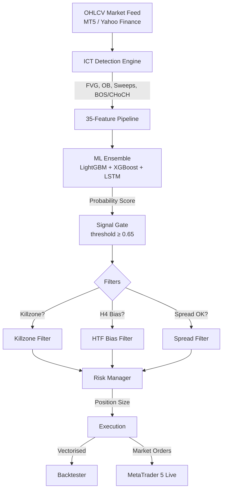

# ICT-TRADE-NEW — Inner Circle Trader Algorithmic Trading Bot

A **production-grade quantitative trading framework** built on the Inner Circle Trader (ICT) methodology. It combines precision market-structure detection with a stacked Machine Learning ensemble (LightGBM + XGBoost + LSTM), a full vectorised backtester, and a live MetaTrader 5 executor — all controllable from a web dashboard or the command line.

> [!WARNING]
> **For educational and research purposes only.** Algorithmic trading carries substantial financial risk. Always validate rigorously on a MT5 demo account before deploying real capital.

---

## ✨ What Was Built and Why

| Capability | Details |
|---|---|
| ICT concept detection | FVG, Order Blocks, Liquidity Sweeps, BOS, CHoCH — mathematically precise |
| ML ensemble filter | LightGBM + XGBoost + LSTM stacked via logistic meta-model |
| Walk-forward training | Temporal splits with purge gap — no lookahead bias |
| Vectorised backtest | Slippage, commission, trailing stop, time stop |
| Killzone filter | London open (08:00–10:00 UTC), NY open (13:00–15:30 UTC) — highest win-rate windows |
| H4 bias filter | Only take M15 entries aligned with the H4 trend direction |
| Adaptive sizing | Shrinks to 70% risk when rolling win rate drops below 35% |
| Spread filter | Rejects entries when broker spread exceeds 3 pips |
| MT5 reconnect | Exponential back-off reconnect (3 retries) — survives brief disconnects |
| News filter | Forex Factory XML blackout 30 min around high-impact events |
| Risk manager | Daily/weekly loss limits, drawdown halt, correlation filter, cooldown |
| Web dashboard | Flask SSE dashboard — run backtests, train models, monitor live trading |

---

## 🏛️ Architecture



---

## 🚀 Quick Start

### Step 1 — Install Dependencies

```powershell
# Clone or download the project
cd ICT-TRADE-NEW

# Create and activate a virtual environment
python -m venv venv
venv\Scripts\activate          # Windows
# source venv/bin/activate     # Mac / Linux

# Install all dependencies (includes Flask, LightGBM, XGBoost, MT5, etc.)
pip install -r requirements.txt
```

> [!NOTE]
> TensorFlow (LSTM model) is **optional** and commented out in `requirements.txt`. The ensemble works without it — LSTM predictions fall back to LightGBM. To enable LSTM, uncomment the `tensorflow` line and run `pip install tensorflow`.

> [!NOTE]
> `MetaTrader5` package is **Windows-only** and installs automatically. On Mac/Linux the package is skipped and the bot runs in backtest/train mode only.

---

### Step 2 — Download Historical Data

Before backtesting or training you need price data. The downloader tries MT5 first, then falls back to Yahoo Finance:

```powershell
# Download EURUSD, GBPUSD, USDJPY on M15 (from Yahoo Finance if MT5 not running)
python main.py --download-data --symbols EURUSD GBPUSD USDJPY --timeframe M15
```

Data is saved as CSV files in `data/`. Expected filenames: `EURUSD_M15.csv`, `GBPUSD_M15.csv`, etc.

---

### Step 3 — Run a Backtest

```powershell
# Single symbol
python main.py --backtest --symbol EURUSD --timeframe M15 --plot

# All configured symbols (from strategy_config.yaml)
python main.py --backtest --multi --plot

# Save metrics to JSON
python main.py --backtest --multi --output logs/results.json
```

**Output example:**
```
--- EURUSD ---
  [EURUSD] loaded 45823 bars
  [EURUSD] 312 signals (FVG 84, OB 178, Sweeps 621, BOS 43, CHoCH 28)
  trades=312  win_rate=52.24%  pf=1.48  sharpe=0.91  net_pnl=+2,341.20  max_dd=-8.21%

=== Portfolio Summary ===
  total_trades              847
  blended_win_rate          0.5186
  avg_profit_factor         1.4300
  avg_sharpe                0.8900
  summed_net_pnl            6412.50
  worst_max_dd             -0.0921
```

> [!TIP]
> **Compare killzone modes.** The killzone filter (`killzone_only: true` in `strategy_config.yaml`) restricts signals to London open and NY open. To see raw results without it, temporarily set `killzone_only: false` and rerun.

---

### Step 4 — Train the ML Ensemble

Training requires at least ~5,000 price bars per symbol. The walk-forward trainer splits data chronologically: 12 months train → 3 months validation → 3 months test, repeated.

```powershell
python main.py --train --symbol EURUSD --timeframe M15
```

**Output example:**
```
Fold 0: train [2022-01..2023-01] val [2023-01..2023-04] test [2023-04..2023-07]
Fold 0 AUC test = 0.5842
Fold 1 AUC test = 0.5721
OOF meta-model trained on 2184 samples across 3 folds
Saved → models_artifacts/ensemble.pkl
```

- AUC > 0.55 means the model has a statistically meaningful edge over random
- AUC ≈ 0.50 means no edge — do not trade with this model
- Trained artifacts are saved to `models_artifacts/`

---

### Step 5 — Launch the Web Dashboard

```powershell
python main.py --dashboard
```

Open **[http://localhost:5000](http://localhost:5000)** in your browser.

The dashboard provides:
- **Backtest tab** — select symbols, run simulation, view equity curve + trade table
- **Train tab** — launch walk-forward training, stream logs in real-time, view fold AUC
- **Models tab** — browse trained artifacts, compare average AUC across runs
- **Live tab** — connect MT5, start/stop the executor, monitor ticks and open positions

---

### Step 6 — Go Live (MT5 Required)

> [!CAUTION]
> **Paper trade for at least 4–8 weeks on a demo account before using real money.** Verify backtest metrics, confirm the AUC > 0.55 on out-of-sample data, and check that live spreads are within acceptable range.

```powershell
# Set MT5 credentials as environment variables (recommended)
$env:MT5_ACCOUNT  = "12345678"
$env:MT5_PASSWORD = "your_password"
$env:MT5_SERVER   = "ICMarkets-Demo"

# Start the live executor
python main.py --live --symbols EURUSD GBPUSD USDJPY --timeframe M15

# Rule-based only mode (no ML model required — uses killzone + structure filters)
python main.py --live --symbols EURUSD --no-model
```

MT5 must be open and logged in before running `--live`. The bot will:
1. Connect to MT5 and read account balance
2. Poll every 5 seconds for new closed bars
3. Run detection → features → ML (if available) → killzone → H4 bias → spread → risk gates
4. Place market orders with pre-set SL and TP
5. Track open positions and update the risk manager on close

---

## ⚙️ Configuration Reference

All config lives in `config/`. Edit YAML files directly — no code changes needed.

### `config/strategy_config.yaml`

```yaml
strategy:
  symbols: [EURUSD, GBPUSD, USDJPY]   # instruments to trade
  default_timeframe: M15

  risk_per_trade: 0.0035               # 0.35% of account per trade
  max_daily_trades: 12
  daily_loss_limit: 0.03               # halt after 3% daily loss
  weekly_loss_limit: 0.06              # halt after 6% weekly loss
  min_model_probability: 0.65          # ML gate threshold

  # Killzone filter — only trade session opens
  killzone_only: true                  # set false to trade all hours
  killzone_windows:
    london_open: ["08:00", "10:00"]    # UTC
    ny_open:     ["13:00", "15:30"]    # UTC

  # H4 bias filter
  htf_filter_enabled: true             # set false to allow counter-trend
  htf_timeframe: "H4"
  htf_bars: 200

  # Adaptive position sizing
  adaptive_sizing: true
  adaptive_sizing_low_wr: 0.35         # shrink below this win rate
  adaptive_sizing_high_wr: 0.45        # restore above this win rate
  adaptive_sizing_low_mult: 0.7        # 70% of normal size in drawdown
  adaptive_sizing_kz_mult: 1.1         # 10% bonus for killzone signals

  # Rule-based-only fallback (no model loaded)
  rule_based_prob: 0.55
```

### `config/risk_config.yaml`

```yaml
risk:
  stop_loss_atr_multiplier: 1.5
  take_profit_r_multiple: 2.0          # 2:1 risk/reward
  trailing_stop_activation_r: 0.8      # trail activates at 0.8R profit
  trailing_stop_atr_multiplier: 1.0
  max_drawdown_halt: 0.10              # halt at 10% peak drawdown
  max_holding_bars: 36                 # 9 hours on M15
  max_open_positions: 6
  max_spread_pips: 3.0                 # reject entries if spread > 3 pips
  reconnect_retries: 3
  reconnect_delay_seconds: 30
  deal_profit_lookback_days: 7
```

### `config/detection_config.yaml`

```yaml
detection:
  fvg_min_gap_atr: 0.6                 # minimum FVG size (ATR units)
  order_block_min_move_atr: 0.6        # minimum displacement for OB
  liquidity_sweep_atr_multiplier: 1.5  # minimum sweep depth
  swing_lookback: 5                    # bars each side of swing point
  bos_confirmation_bars: 2             # closes needed to confirm BOS
```

### `config/model_config.yaml`

```yaml
model:
  walk_forward:
    train_months: 12
    val_months: 3
    test_months: 3
    purge_bars: 5          # prevents label bleed at fold boundaries
  bayesian_iterations: 50  # hyperparameter search iterations
```

---

## 📂 Project Structure

```text
ICT-TRADE-NEW/
├── config/
│   ├── detection_config.yaml     # FVG, OB, sweep, BOS thresholds
│   ├── model_config.yaml         # ML hyperparameters, walk-forward settings
│   ├── risk_config.yaml          # risk limits, spread filter, reconnect
│   └── strategy_config.yaml      # symbols, killzone, HTF, adaptive sizing
│
├── dashboard/
│   ├── app.py                    # Flask API + SSE server
│   ├── templates/index.html      # Single-page web terminal
│   └── static/                   # CSS and JavaScript
│
├── data/                         # Downloaded OHLCV CSVs (e.g. EURUSD_M15.csv)
├── logs/                         # Equity curve PNGs, event logs
├── models_artifacts/             # Trained ensemble.pkl + training_summary.json
│
├── notebooks/                    # Jupyter analysis notebooks
│
├── scripts/
│   ├── download_data.py          # Historical data downloader (MT5 → yfinance fallback)
│   ├── run_backtest.py           # Multi-symbol vectorised backtest runner
│   ├── run_live.py               # MT5 live executor launcher
│   └── train_model.py            # Walk-forward ensemble trainer
│
├── src/
│   ├── backtest/
│   │   ├── engine.py             # Vectorised simulator (SL/TP/trail/time stop)
│   │   └── metrics.py            # Sharpe, Sortino, Calmar, profit factor, etc.
│   │
│   ├── detection/
│   │   ├── fvg.py                # Fair Value Gap detection
│   │   ├── liquidity.py          # Sweeps, equal highs/lows, ATR
│   │   ├── orderblock.py         # Order block detection + mitigation tracking
│   │   ├── session.py            # London / NY / Asian session labels
│   │   └── structure.py          # BOS and CHoCH detection
│   │
│   ├── features/
│   │   ├── builder.py            # 35-feature pipeline (no lookahead)
│   │   └── labels.py             # Triple-barrier labelling for ML training
│   │
│   ├── live/
│   │   ├── executor.py           # Live trading loop (all filters wired in)
│   │   ├── mt5_client.py         # MT5 wrapper (rates, orders, spread, deal history)
│   │   └── onnx_export.py        # ONNX model export for low-latency inference
│   │
│   ├── models/
│   │   ├── inference.py          # EnsembleModel — load + predict
│   │   ├── lightgbm_model.py     # LightGBM train/predict helpers
│   │   ├── lstm_model.py         # Keras LSTM train/predict helpers
│   │   └── train_ensemble.py     # Walk-forward ensemble trainer
│   │
│   ├── strategy/
│   │   ├── risk_manager.py       # Account-level gates + adaptive sizing
│   │   └── rule_based.py         # Signal generation, scoring, killzone filter
│   │
│   └── utils/
│       ├── data_loader.py        # CSV / MT5 data loader
│       ├── htf_bias.py           # H4 bias cache for live executor
│       ├── logging_utils.py      # Structured logging setup
│       └── news_filter.py        # Forex Factory news blackout filter
│
├── tests/                        # pytest suite
├── main.py                       # CLI dispatcher
└── requirements.txt              # All dependencies
```

---

## 🧪 Testing

```powershell
# Run the full test suite
venv\Scripts\pytest tests/ -v

# Expected output
# tests\test_detection.py .......   [ 63%]
# tests\test_features.py ....       [100%]
# 11 passed in 3.84s
```

---

## 🛡️ Risk Management — How It Works

Every potential trade passes through **six sequential gates** before an order is placed:

```
Signal Generated
      │
      ▼
[1] ML Gate ──────────── probability < 0.65 → SKIP
      │
      ▼
[2] Killzone Gate ─────── outside London/NY open → SKIP  (if enabled)
      │
      ▼
[3] H4 Bias Gate ──────── counter-trend to H4 → SKIP     (if enabled)
      │
      ▼
[4] Spread Gate ───────── broker spread > 3 pips → SKIP
      │
      ▼
[5] Risk Manager ──────── daily limit / drawdown halt / cooldown / correlation → SKIP
      │
      ▼
[6] Position Sizing ───── risk × adaptive_multiplier → volume
      │
      ▼
   Place Order
```

**Adaptive position sizing** then scales the final volume:
- Normal market: `risk_per_trade = 0.35%`
- Win rate < 35% (10-trade rolling): `0.35% × 0.7 = 0.245%`
- Signal in killzone: `0.35% × 1.1 = 0.385%`
- Both: `0.35% × 0.7 × 1.1 = 0.27%`

---

## ⚡ Recommended Workflow (First-Time Setup)

```
1. pip install -r requirements.txt
2. python main.py --download-data --symbols EURUSD GBPUSD USDJPY
3. python main.py --backtest --multi --plot        ← verify signals exist
4. python main.py --train --symbol EURUSD          ← check AUC > 0.55
5. python main.py --dashboard                      ← visual review
6. [DEMO ONLY] python main.py --live --symbols EURUSD --timeframe M15
7. [After 4–8 weeks demo] consider real capital
```

---

## 📜 License

Personal / Educational use only. Redistribution or commercial execution is prohibited without explicit licensing.
